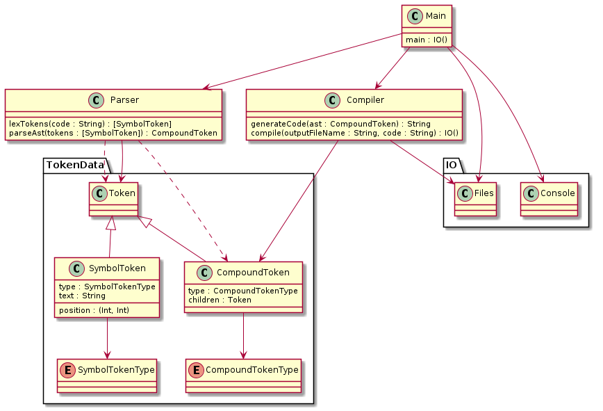

# "Keep It Simple Stupid" Language

## Description

A language to end all languages. The goal of this language is essentially to re-create my language [snake script](https://github.com/blueOkiris/snake-script) but with expansion, immutability, and a compiler to machine code.

I want to reinvent that language to be a practical, simple, low-level scripting language.

## Building Compiler

The compiler, `smooch`, can be built using the program "stack" by calling `stack build` in the project directory. You can run it with `stack exec smooch <filename>`.

After building, the executable, `smooch` can be found in the folder `.stack-work/dis/<build-platform>/<cabal-version>/build/smooch/`

## Language Definition

So first of all, kiss-lang is a statically typed language where all data is immutable. You can compose expressions through repeated function calls though. It will also still have a stack which will be implmented (when compiled to C++ code) as a vector containing a representation of the data as the object stored in the vector. All instructions pop one value off the top and push one value back on. However, a few stack functions will manage the stack such as moving an item from deep in the stack to the top, removing an item, duplicating an item, etc. It's purpose is for large-scale data manipulation like structs and stuff, but functions always modify just the top of the stack.

It's very expressive despite this because of the list and tuple types, so instead of saying `2 x -` for getting the value of x and subtracting two, you'd say `(x 2) -` which would take the tuples and manipulate them.

It will have a similar set of stack operations to snake script, but obviously a bit different. The biggest challenge is most likely list manipulation. So instead of unzipping all the items onto the stack, you'll manipulate them by doing things like splicing into a tuple of two lists that have been split off from the original.

Like snake script, there are a handful of specific types:

 * Characters are any single character (including escape sequences) declared using `0c<character>`, and they can directly be converted to and from bytes
 
 * You have integer types of various sizes. They are the ones from C, but with consistent meanings:
    
    + byte - signed 8-bit integer
    
    + short - signed 16-bit integer
    
    + word - signed 32-bit integer
    
    + long - signed 64-bit integer
    
    You can put a sequence of digits to define them or `0x<number>` for hex or `0b<number>` for binary. Also, a byte count type must be specified with a colon and a number
    
 * There are also the two floating point numbers: float and double  and they're defined by a sequence of numbers with a decimal point
 
 * Booleans are represented by `true` for true and `false` for false. Like chars, they can be directly translated to and from bytes
 
 * Lists are defined as `[`, any sequence of values *of the same type*, and then `]`.
 
 * Strings can either be defined as a list of chars i.e. `['a''b''c' ]` *or* they can be defined using single quotes `'abc'`. The quotes are just syntactic sugar of course.
 
 * Tuples can be defined by `(`, any two values, and then `)`
 
 * Constant references can be pushed by simply giving their name. By default constants have no value and will throw errors when used. You can set them and their type using the assignmnet operator `=`. Once a value and type have been set *they cannot be changed*
 
 * Structs work similar to C, but like named constants and value constants, they too are constant. I plan to implement a sort of record syntax a la Haskell where you can create a copy of a struct with one or more of its values changed.
 
 * Last it's good to note that you can define lists of lists or lists of tuples or lists of lists of tuples of ints and lists of characters and so on. It's recursive
 
All functions have a single input and single output, but side effects like file I/O and output are allowed.

With all of that said, here's the ebnf.

Symbol Tokens:

```
<keyword>       := /loop|func|struct/
<boolean>       := /true|false/
<integer>       := /([0-9]+|0x[0-9A-Za-z]+|0b[01]+):[1248]/
<float>         := /([0-9]+\.[0-9]*|\.[0-9]+):[48]/
<character>     := /0c(\\.|[^\\])/
<string>        := /'(\\.|[^\\'])*'/
<type-char>     := /#:[1248]|\.:[48]|@|\?/
<identifier>    := /[A-Za-z_][A-Za-z_0-9]*/
<parenth>       := /\(|\)/
<bracket>       := /\[\]/
<brace>         := /\{\}/
<ret-op>        := /->/
<double-arrow>  := /<<|>>/
<operator>      := /\+|-|\/|%|\+\+|--|==|!=|>|<|>=|<=|&&|\|\||!|&|\^|~|=/
<type-op>       := /::/
<member-op>     := /\./
```

Compound Tokens:
```
<raw-type>      := <boolean> | <integer> | <character> | <string> | <identifier>
                    | <float>
<tuple>         := <parenth> <type> <type> <parenth>
<list>          := <bracket> [ <type> ] <bracket>
<struct>        := <parenth> <identifier> <parenth> <brace> { <type> } <brace>
<struct-access> := <identifier> [ <member-op> <identifier> ]
<type>          := <raw-type> | <tuple> | <list> | <struct-access> | <struct>
<type-name>     := <type-char> | <identifier>
                | <parenth> <type-name> <type-name> <parenth>
                | <bracket> <type-name> <bracket>

<body>          := <brace> { <stmt> } <brace>
<func-def>      := <keyword> <identifier> <type-op> 
                        <type-name> <ret-op> <type-name> <body>
<loop>          := <keyword> <body>
<cast>          := <double-arrow> <type-name> <double-arrow>
<struct-def>    := <keyword> <brace> 
                        { <identifier> <type-op> <type-name> } <brace>
<stmt>          := <type> | <func-def> | <loop> | <cast> | <operator>
                | <struct-def>
<program>       := [ <stmt> ]
```

## Novel Parser Design

So I had this idea. I'm using regular expressions and looping through the list until I find one that matches the current index of the code as I iterate through it (this gets around some of the issues of using regular expressions for lexer). What if I applied that to the parser?

The way it works is instead of ebnf tags, I assign each token a character. Then I can define compound tokens as regular expressions as well. I can loop through all the rules, and match and replace as many times as possible, and then check if everything is a statement. If not then I can loop again, over and over and over again. If nothing changes in an iteration, but we're not at all statements, then there's an error.

So the lexer works the same getting a set of symbol tokens (which have a source, a position, and a character)

So here's the symbol tokens ebnf with the characters:
```
 k : <keyword>      := /loop|func|struct/
 b : <boolean>       := /true|false/
 i : <integer>       := /([0-9]+|0x[0-9A-Za-z]+|0b[01]+):[1248]/
 f : <float>         := /([0-9]+\.[0-9]*|\.[0-9]+):[48]/
 c : <character>     := /0c(\\.|[^\\])/
 ' : <string>        := /'(\\.|[^\\'])*'/
 @ : <type-char>     := /#:[1248]|\.:[48]|@|\?/
 n : <identifier>    := /[A-Za-z_][A-Za-z_0-9]*/
 ( : <parenth>       := /\(|\)/
 [ : <bracket>       := /\[\]/
 { : <brace>         := /\{\}/
 > : <ret-op>        := /->/
 < : <double-arrow>  := /<<|>>/
 = : <operator>      := /\+|-|\/|%|\+\+|--|==|!=|>|<|>=|<=|&&|\|\||!|&|\^|~|=/
 : : <type-op>       := /::/
 . : <member-op>     := /\./
```

```
 r : <raw-type>      := /[bic'nf]/
 , : <tuple>         := /\(tt\(/
 l : <list>          := /\[t+\[/
 s : <struct>        := /\(n\(\{t*\{/
 S : <struct-access> := /n(\.n)+/
 t : <type>          := /[r,lsS]/
 N : <type-name>     := /[@n]|(\(NN\()|(\[N\[)/

 } : <body>          := /\{I*\{/
 F : <func-def>      := /kn:N>N\}/
 L : <loop>          := /k\}/
 a : <cast>          := /<N</
 d : <struct-def>    := /k\{(n:N)*\{/
 I : <stmt>          := /[tFLa=d]/
<program>            := /s+/
```

## Compiler Domain Diagram

I'm using Haskell, not an OOP language, but classes without private state can act as modules containing functions and thus translate directly to functional code structure (or possibly a type)

This will help me plan my project.



